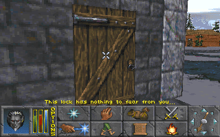

Sundas the 21th of Morning Star,

\[caption id="" align="alignleft" width="320"\] The Citadel of Gaersley.\[/caption\]

Hurray! I think I managed to slay the werewolf. It's too bad my visual memory cannot be put into words, they will fade away with time. It's a shame that the one who finds this journal after my death won't be able to see my confrontation with the werewolf, or the rising sun when I'm travelling, or a beautiful smiling lady in the city of Daggerfall. I did manage to make a sketch of the Citadel of Gaersley as you can see. Now, three days later, I'm back in the great city of Daggerfall to collect my reward.

http://youtu.be/Xcq1S-5RkFQ

\[caption id="" align="alignright" width="320"\] The Fighters Guild Tower.\[/caption\]

Though when I entered the city, a messenger gave me a letter from Lady Magnessen, the Emperor's agent in the court of Daggerfall, saying I have to meet her in The Black Ogre in Holwych to discuss the Emperor's mission. Even though this is probably a very important matter, I don't think I'll be able to travel such long distances yet, with my strained ankle and all.

\[caption id="" align="alignleft" width="320"\] The Fighters Guild and laziness.\[/caption\]

After that, I went to the Fighters Guild tower, as you can see in the drawing. The tower is not that big but that's not a problem as, in the end, it's surrounded by the walls of the great city of Daggerfall. So, in order to collect my reward, I have to get inside but what happens? The door is locked! How is that possible? Well, it turns out the members of the Fighters Guild are lazy. After I loitered for a while - it was eleven o' clock - the door finally opened when I got back at around two o' clock. All they do is sleep appearantly.

\[caption id="" align="alignright" width="320"\] The silent quest-giver.\[/caption\]

So, when I finally got in, I politely greeted my quest-giver and fellow member of the Fighters Guild but something awkward happened. The man did not seem te respond at my greetings and also when I asked him about my quest, he remained silent. Even when I took fifteen minutes to make a drawing of him he acted like I was not even there! Maybe I should return to the Citadel to check whether I killed the right werewolf of maybe my quest-giver just has an enormous hangover.

Ainab.
