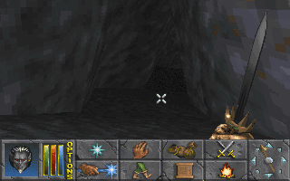

Sundas the 5th of Sun's Dawn,

 

\[caption id="" align="alignleft" width="320"\] The large open space inside the citadel.\[/caption\]

I decided to go back to Gaersley, just to be sure and to clear out the whole citadel. I traveled by foot and did not rest at inns but in the wilderniss. I always do that. Inns are expensive and I'm saving to to buy a horse. In the Citadel of Gaersley I soon discovered the building was much larger. I think during my last visit I had only explored one out of ten of the total area. And so, during my second visit, I found great things like new torture rooms, equipment and of course the werewolve I actually was supposed to slay. The werewolve actually wasn't the hardest part of this quest. The giant spiders were a greater threat than the werewolves. For example, the werewolve that was my target, died after one hit of my sword.

\[caption id="" align="alignright" width="320"\] The cave beneath the citadel.\[/caption\]

After I returned to the Fighters Guild, the quest-giver finally talked to me again and gave me my reward which was a sum of gold, very small in comparison to the loot I sold to the local weapon and armor shops. He also gave me a map to a place called Ruins of Old Lysyna's Farm with the message of 'All the killing and treasure you can handle. Knock yourself out.' I'll probably will do this another time, there are more important things to do right now, like selling loot and meeting up with Lady Brisienna.

\[caption id="" align="alignleft" width="320"\] Proof of me, Ainab, killing the lycantrope.\[/caption\]

So I sold my loot and got me a elven longbow, which I hope will really help me kill creatures from a great distance. I'm not that great in archery but Dark Elves have proven to be good archers in the past so I'm hoping there is at least some talent flowing through my vains. After buying the longbow, I even had enough drakes to buy me a horse - not that I did. Pretty quick if you tell me, these lands are so much more prosperous than my homeland.

\[caption id="" align="alignright" width="320"\] The quest-giver, finally speaking to me again.\[/caption\]

After trading with the local shopkeepers, I traveled to Holwych to meet up with Lady Brisienna. She told me the ghost of King Lysandus haunts the streets of Daggerfall at night. She recommended me not to go outnight and that trying to communicate with him will be futile. I am to investigate the friends, family and acquintances of the late King to find out the cause behind his torment. I should start with the three major powers of the Ilica bay, which are the royal families of Daggerfall, Wayrest and Sentinel. Also, I have to find out what is become of the letter to Queen Daggerfall.

\[caption id="" align="aligncenter" width="320"\] Lady Brisienna.\[/caption\]

By Azura, this is different than killing foul creatures! I will actually meet royal families in order to find more information. I will leave tommorrow! But first I'm going to buy a horse.

\- Ainab
