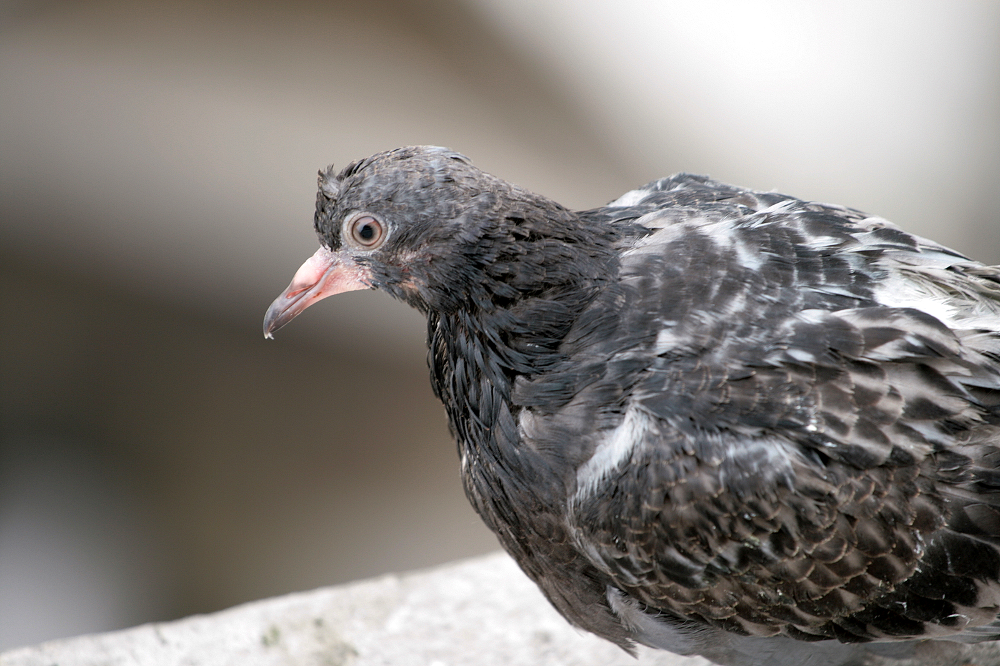

It's that time of the year again where it is almost vacation and only a couple of weeks are between me and a lot of freetime. Too bad that in those two weeks I have five exams and one paper due. So today I started to study for Real and promised myself not to play games or do anything fun for two weeks. Two weeks is not that long and after it I would be done until September, so no biggie right?

**7:00**: The alarm goes off, but since I still have a couple of days till the first exam I can afford to stay in bed until 8. I will be more awake and productive then anyway.

**9:15**: Well that took a bit longer than expected, really need to start using that snooze function. Well it's already late so I better take a shower so I really wake up. Good thing I am a morning person otherwise it would be twelve now already.

**9:43**: Well just some breakfast now and I am ready to begin! But let me check the news first.

**10:02**: Might as well check facebook, google plus, and some game news, so it will not distract me later.

**10:55**: Better watch these three youtube videos while I make coffee.

**11:20**: I should answer these school related emails before I really begin.

**11:21**: oh! a google plus update.

**11:30**: Not sure if should reply friendly or demandingly to this teachers email, better make some coffee while I think about it.

**11:45**: I have to poop

**12:23**: Ok I am really gonna start.

**12:40**: Time for some lunch, you cannot study on an empty stomach, and while I eat I could watch an episode of  Game of Thrones.

**13:30**: Still enough time to study for real today, so one more cup of coffee and then I will do nothing else but study.

**13:40**: I should vacuum, it is really dirty in here.

**14:00**: Discussing with my roommate what to have for dinner and who should do groceries. We decided it would be best if he would do them, since I am really busy.

**14:15**: Moving to the balcony, because it's really nice outside.

**14:20**: There is a ugly pigeon on the balcony, I should take a photo.

\[caption id="" align="alignnone" width="1600"\] I could not find my camera but it looked something like this one.\[/caption\]

**14:45**: Well that is the first chapter, I should really finish the second one faster.

**14:56**: I should take a break, I cannot concentrate like this, maybe one icehockey match on NHL 12 would be ok.

**15:20**: Ok one more match and then I will not do anything else until I studied another chapter, no! 2 Chapters!!

**16:05**: Maybe I should do the groceries so I get some fresh air.

**17:30**: Groceries took a bit longer than expected.

**17:45**: I can't study when I am hungry, I should prepare diner and study after that.

**19:30**: Tomorrow I should not watch the news after diner, because there is always something interesting on after that.

**19:40**: Who am I kidding, I can't study after 7pm. Maybe if I play [SWTOR](http://www.swtor.com/) until 10pm and go to bed early I will be able to get up at 7am.

**23:20**: Ok this is REALLY going to be my last PVP match.

**23:46**: I should watch one episode of [Mad Men](http://www.youtube.com/watch?v=WcRr-Fb5xQo) to relax after all that pvp action.

**1:55**: Did not know the first episode of the season is twice as long.

