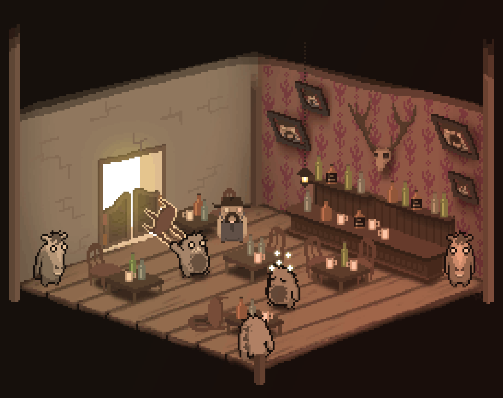

The internet is full of strange and interesting things and a project with the working tile 'The Cresting Rainbow', definitely fits in both categories. The title tells you little about what it might entail, but the developers define it as a turn-based bar fighting game. From a isometric view you can move small unidentifiable animals around a grid and let them fight each other and throw furniture around. A wonderful concept if you ask me. The game is developed by Stray Robot Games and you can follow the progress of their games on [their blog](http://www.strayrobotgames.com/).

\[caption id="" align="aligncenter" width="1092"\] Pixel art from the Stray Robot DevLog\[/caption\]

The game is at an early stage and it is still unknown when it will be playable. The little we do know is very interesting so we should keep an eye on this one.
