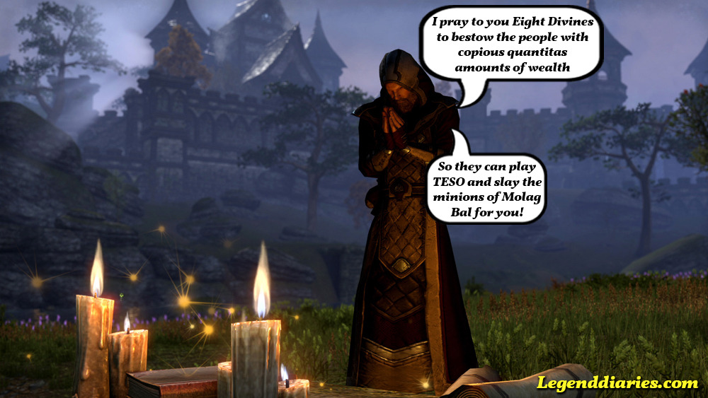

Yesterday Zenimax revealed the digital and retail versions of The Elder Scrolls Online that are going to be available at launch. There are going to be two digital and two retail versions, a collectors edition and a normal copy of the game. All pre-order packs come with the pre-order explorer's pack and a 30 days subscription. Only with the digital versions you get 5 days early access. So what does it cost?

- The digital Standard Edition is priced at €54.99 /$59.99  / £49.99.
- The digital Imperial Edition is priced at €79.99 / $79.99 / £69.99.
- The Standard retail Edition for PC/Mac will cost  €54.99 / $59.99  / £49.99 
- The PlayStation 4 and Xbox One versions are priced at €69.99 / $59.99  / £59.99.
- The retail Imperial Edition will cost  €99.99 / $99.99  / £89.99 on all platforms.

Pretty steep pricing for a game that also has an additional monthly fee.

The real problem however, is what is contained within. Those who watched the development of TESO closely might have noticed the absence of the Imperial race. The Imperial race is only playable when you buy the expensive collectors edition. Imperials can be played across all factions and you will get a pretty white horse and Imperial armor as well, isn't that nice?

No. It is not uncommon to add some in-game incentives with the collectors edition, but this is a complete race that you cannot play if you are not willing/not able to pay 80 euros for the collectors edition. In other words: you pay full retail price for the game with the standard edition plus a monthly fee and you do not even get to enjoy the complete game.

Then there is that explorer's pack that comes with all pre-orders. It contains a pet, a map and the ability to play with any race in any alliance. Wait.. what? With any race in any alliance? But what is the whole point of dividing up the races in the first-place? Very strange move from Zenimax and I hope these pre-order incentives do not reflect the rest of their business model, because the direction they are taking doesn't look good.

I believe I have made my disappointment about the available pre-orders clear, but what I really hope is that Zenimax is not digging their own grave with these strange incentives and high costs for players. If they pull more tricks like this, I am afraid this game will fail before people start playing it, because they won't.

What do you think? Is it still a buy for you? Let me know in the comments!
