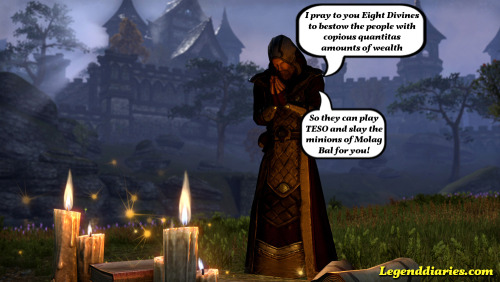

**In January I played SWTOR and GTA Online and of course one heavenly weekend in the TESO Beta! Not a bad start for 2014. I am also still holding up my new-years resolution with my friends to send more selfies to each other.**

#### Legenddiaries in January

**[TESO Imperial Edition, for wealthy Imperials only](http://www.legenddiaries.com/articles/imperialeditionteso/)**

**[Steam Greenlight: RymdResa](http://www.legenddiaries.com/features/steam-greenlight-rymdresa/)**

**[The Cresting Rainbow](http://www.legenddiaries.com/articles/the-cresting-rainbow/)**

**[1 Year anniversary](http://www.legenddiaries.com/other/1-year-anniversary/)**The Elder Scrolls Online Beta In the second week of January there was a beta stress test for TESO and I was finally invited. While I cannot post screenshots or share any content of the beta version, I can say what I think about it a little bit. This MMO has very high expectations to fulfill since it has to live up to the single-player series and be a enjoyable MMO at the same time, not an easy task. I must say though that, even for a beta version, TESO has potential and a great atmosphere. I really took me back to Morrowind (literally Since you can visit Morrowind quite soon but also because I am now playing TES III until TESO is released). My overall experience was very positive and I am pretty sure I am going to buy it at launch despite the steep costs and strange incentives.

#### Revisiting Los Santos

It had been over two months since I logged in on GTA Online and last week I suddenly wanted to check out the last updates and the player created content. The player created content offers a nice variety to the existing jobs. Especially the player created drift tracks are awesome.  The new game mode ' capture the suitcase'  that Rockstar added, is a nice addition. I am still missing co-op heists though and there is still not much to do in free-roam except killing other players.

#### Plans for February

I am currently writing a piece about my Ingress experience so far and I am watching the Maxis blog closely for any Simcity offline updates, because this might mean we finally get bigger maps through mods!
