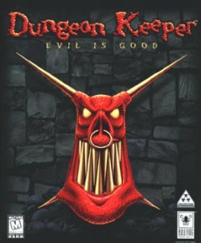

No not another give-away from Legenddiaries, but from GOG.com. In the next 48hours you can download the classic Dungeon Keeper for free. They must have thought that the recent disappointment of [Dungeon keeper for mobile devices](http://www.ea.com/dungeon-keeper-and) released by EA, was a good opportunity to let people enjoy Dungeon Keeper the way it was meant to be played: without pulling your wallet or hours of waiting. If you have not played it back in the day, Dungeon Keeper might be to big a step back but I say you should try it nonetheless. You can check the first couple of minutes gameplay in the video below.

http://www.youtube.com/watch?v=iHio90Qzryg&list=PL7m6K5bGjiEVgi6xr5pBl3YI0yELq\_F5h&feature=share

You can get your copy of Dungeon Keeper from [GOG.com](http://www.gog.com/) now, all you have to do is create an account and hit the download button! The offer lasts until Sunday morning European time.
