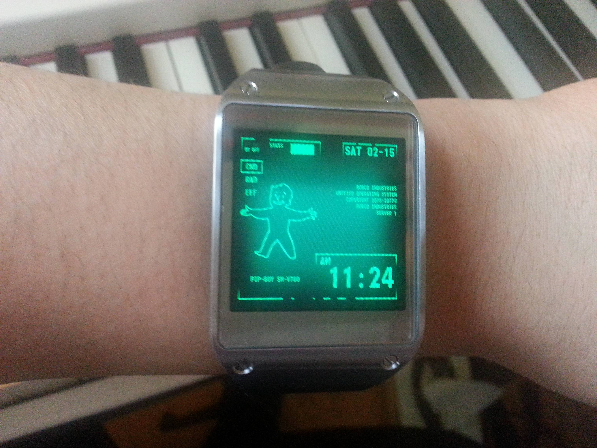

Tired of waiting on your father to give you a [Pip-boy](http://fallout.wikia.com/wiki/Pip-Boy) for your birthday? Well the waiting is over because you can transform your own android device into a Pip-boy. Preferably one you can wear on your writs like the dude in the picture below. Although the perk-system is not yet included, it is still pretty awesome.

With the correct plugins you can get it working like just any other android skin. [This tutor](http://www.androidpolice.com/2013/10/27/this-fantastic-fallout-pipboy-homescreen-lets-you-party-like-its-2299/)[ial](http://www.androidpolice.com/2013/10/27/this-fantastic-fallout-pipboy-homescreen-lets-you-party-like-its-2299/) explains how to get your android device on Vault 101 settings.

