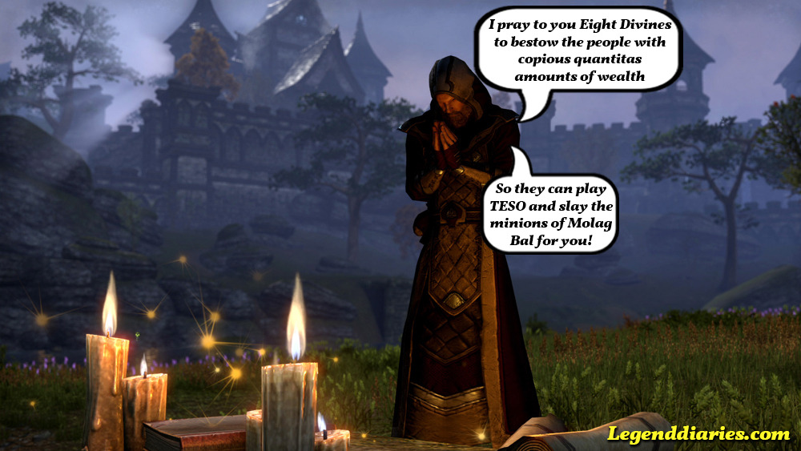

#### Someone told me today that February has only 28 days, so I quickly dropped everything and sat down to provide you with a monthly diary. February was not only a short but rather boring month: lots of studying, work and rain are not really things I enjoy. So thank the Nines Divines that there are still games to play to get away from it all!

### Legenddiaries in February

- **[The first Legenddiary giveaway](http://www.legenddiaries.com/other/humble-bundle-giveaway/)**
- **[Why I am glad Flappy Bird is gone](http://www.legenddiaries.com/articles/why-i-am-glad-flappy-bird-is-gone/)**
- **[Agent Yozarian reporting for duty](http://www.legenddiaries.com/articles/agent-yozarian-reporting-for-dut/)**
- **[Falskaar](http://www.legenddiaries.com/articles/falskaar/)**

### Banished

I had been anticipating this game since it was announced in October 2013 and last week I could finally play it. I will be posting a review in the beginning of March, but I can already tell you that Shining Rock has not disappointed me. It is one of the best, most difficult and enjoyable city-building strategy games I have played in a long time. For the past two week all my freetime went to expanding my town or building a new one, because the previous one burnt down or starved to death. It can easily be called the  'Dark Souls' of city-building games. So check Legenddiaries in the coming weeks for the review.

### Music intermezzo

http://youtu.be/4342G\_ekanY

### The Elder Scrolls Beta

There has been a beta almost every weekend since January and although [I was not happy](http://www.legenddiaries.com/articles/imperialeditionteso/) with the Imperial Edition of the game, I did enjoy the Beta so far. I must say though that it has not really got me hooked yet. It is all very good, but it is not great. Normally that would not keep me from playing it, but if you have to pay €12 a month on top of the initial €60 for the game.. it really has to be amazing. So I am not sure yet if I am going to play TESO once it is released. Have you played the beta yet? Let me know in the comments what you think of it so far!

### Legenddiaries in March

Except for the Banished review I have nothing planned yet, but I am aiming to post twice a week on Thursdays and Sundays. So check Legenddiaries on those days or just like [Legenddiaries on Facebook](https://www.facebook.com/Legenddiaries) so you get updates on your timeline!
