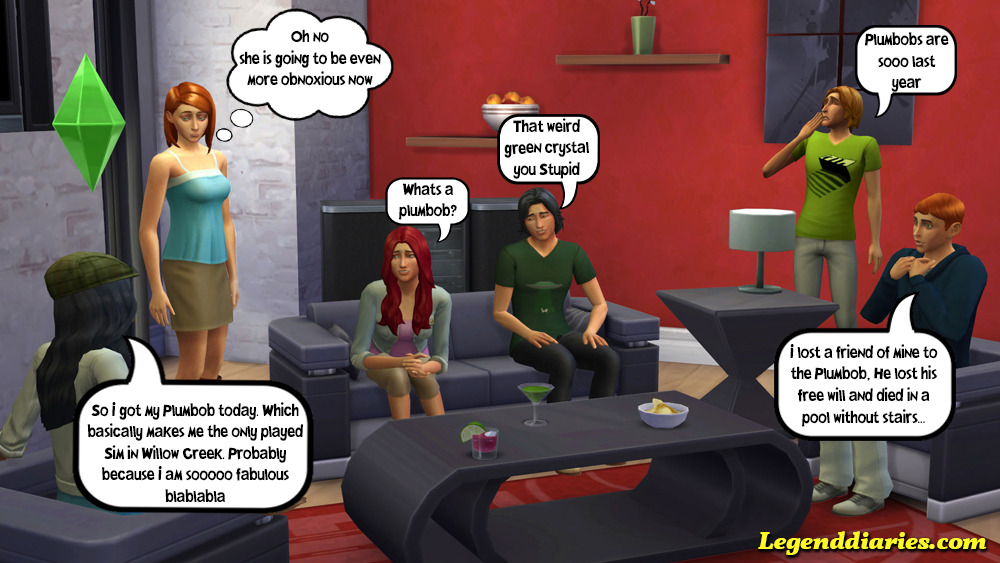

#### Toen ik The Sims 4 [previewde](http://www.legenddiaries.com/nederlands/preview-sims-4-gameplay-trailer/) leek deze game gedoemd om te falen. Nu ligt de game in de winkels en is het tijd om te kijken of het inderdaad een fiasco is geworden of dat die negativiteit om een stel peuters en een zwembad een beetje overdreven was.

**Genre:** Virtueel Poppenhuis  
**Ontwikkelaar:** Maxis  
**Plaftorm:** Windows (Er is nog geen teken van een Mac versie)

Uit de eerste gameplay videos was al duidelijk dat de focus van The Sims 4 op andere zaken ligt dan in The Sims 3. Het leek erop dat er met veel gameplay elementen [twee stappen terug werd genomen in plaats van één vooruit](https://www.youtube.com/watch?v=TmVJMbB1nFg). De laadschermen zouden terug zijn en daarmee de open wereld, waar we in The Sims 3 zo van waren gaan houden, verdwenen. Dit mis je alleen als je op een Windows computer speelt, want de mensen die The Sims op een Mac spelen moeten  vooralsnog met The Sims 3 genoegen nemen.

#### Dikke billen

Dat Maxis met The Sims 4 een andere kant op wil, wordt meteen duidelijk als je de game opstart. Je begint namelijk in de buurt, maar je mag meteen nieuwe sims gaan kleien in Creëer een Sim (CAS). Dat is erg slim, want hier heeft The Sims 4 misschien wel de meeste vooruitgang geboekt. Je kan vrijwel overal met je cursorhandje aan kneden en je sim de vormen geven die jij begeert. Grote voeten, een kleine neus, dikke billen? Zandloper-, peer, of ananas figuur? Je kan je sims net zo gek of mooi maken als jij wil en dit is een grote verbetering op de vorige CAS.

Wat kleren betreft is de keuze beperkter, maar het is dan ook een basisgame. Wat wel jammer is, is dat je niet langer een eigen stijl kan creëren door middel van de patronen die beschikbaar zijn in de games. In The Sims 3 kon je een broek een houtpatroon geven of een shirt met een gordijnen patroon maken. In de The Sims 4 zit je vast aan de kleuren en patronen die Maxis aan een kledingstuk heeft toegekend. Nu is er genoeg keuze en zeker voor een basisgame mogen we niet klagen.

Als je klaar bent met kneden moet je net als in het vorige deel een levenswens kiezen voor je sim en drie karaktereigenschappen. Dat het er drie zijn geworden ten opzichte van de vijf of meer die je in The Sims 3 had, is jammer. Echter zijn de karaktereigenschappen die je je sim geeft meer uitgesproken en geven ze je sims voldoende kleur. Het zou wel mooi zijn als het aantal eigenschappen in toekomstige uitbreidingen nog wat omhoog geschroefd wordt.

_Check [aflevering 1](http://www.legenddiaries.com/nederlands/lets-play-the-sims-4-aflevering-1/) van Let's play The Sims 4 voor Create a Sims gameplay._ 

####  Blijheid zonder vrijheid

Als je sim af is mag je een plekje uitzoeken in de twee buurten/werelden die  in de basisgame zitten. Dit is een grote stap terug ten opzichte van The Sims 3 en zelfs ten opzichte van The Sims 2 is het magertjes. Hoewel het twee buurten zijn en je sims zonder moeite tussen deze twee buurten kunnen reizen en zelfs verhuizen, is het allemaal erg beperkt. De werelden zijn onderverdeelt in ongeveer vijf wijken die vervolgens uit circa zes kavels bestaan. Met het startbedrag dat een nieuwe familie krijgt kun je uit ongeveer 4 kavels kiezen, wat toch wel erg weinig is.

Binnen een wijk kun je vrij rondlopen en de boel verkennen, je kan dus nog steeds bij je directe buren op bezoek. Op het moment dat je naar een openbaar kavel wil of een verre buur, krijg je een laadscherm. De buurt zelf is niet bijzonder uitgebreid aan te passen en ik hoop dat Maxis hier met uitbreidingen nog aan de weg gaat timmeren. The Sims 4 heeft in elk geval definitief afscheid genomen van de open werelden en hebben de sims veel minder vrijheid, al zijn ze daar zelf niet minder vrolijk door.

#### Kant-en-klaar

Het bouwen zou alles goed moeten maken, althans hier zette Maxis vol op in bij de promotie vooraf. De nieuwe bouwmodus zou makkelijker, uitgebreider en sneller zijn dan die in de vorige delen. Hier komt Maxis gelukkig honderd procent over de brug. Het bouwen in The Sims 4 is heerlijk en heeft veel nieuwe elementen. Aanpasbare dakranden, ronde aanrechten, in hoogte aanpasbare muren en kant-en-klare kamers zijn een aantal, maar zeker niet alle aanpassingen op dit gebied.

De kant-en klare-kamers zijn erg handig. Als je meteen aan de slag wil met het leven van je sims kun je in vijf minuten een huis uit de grond stampen.Of als je wel van bouwen houdt maar je vindt badkamers maar saai, kan je zo uit de catalogus halen en toevoegen. De bouwmodus is in elk geval dik in orde.

#### De emoties kunnen hoog oplopen

Een ander element waar Maxis hoog op inzet zijn de verschillende emoties die de sims in dit deel hebben. Vrolijk, verdrietig, gemotiveerd, flirterig, het brengt de sims letterlijk in alle staten. In eerste instantie lijkt dit nieuwe element meer een gimmick dan dat het echt wat toevoegt. Met de verschillende stemmingen komen echter ook specifieke handelingen die je sims anders niet uit kunnen voeren, denk bijvoorbeeld aan een extra goeie pickup-line als je sim in een zelfverzekerde stemming verkeerd. Daarnaast zijn er acties die ervoor zorgen dat je sims in een bepaalde stemming komen, zoals een peinzende douche om geïnspireerd te raken.

Nu klinkt dit als alleen maar meer werk naast het onderhouden van de basisbehoefte van je sims, maar het zorgt juist voor veel meer afwisseling. Door deze stemmingen en de speciale acties die er aan verbonden zijn zul je eerder acties uitvoeren die je normaal niet zou aanraken. De emoties brengen dus meer diepgang en afwisseling naar de game en dit is een mooie vooruitgang ten opzichte van de vorige delen.

#### De sims-ervaring

Hoewel The Sims 4 een hoop ontberingen kent, zijn er heel veel zaken ook flink verbeterd. En ik heb zaken als een nieuwe schone interface, sims die meer praten dan ooit, in-game spullen van de community downloaden en multitasking(!) nog niet eens genoemd. Natuurlijk kunnen er een hoop voor en nadelen tegen elkaar weggestreept worden, maar de vraag is natuurlijk of dit spel een goeie sims-ervaring is en leuk is om te spelen.

Vooraf en ook in sommige reviews wordt verkondigt dat The Sims 4 de ondergang van de serie gaat worden. Maxis heeft met dit deel een andere weg in geslagen en ze hebben gekozen voor een meer gestroomlijnde en strakke sims-ervaring. Dit is een gewaagde zet en het is zeker ten koste gegaan van een aantal features uit The Sims 3. Dit neemt echter niet weg dat The Sims 4 ontzettend leuk is om te spelen. Ik mis de open werelden ook, maar het is deze week meerdere malen voorgekomen dat ik aan het spelen was en het opeens twee uur s'nachts was, zo erg mis ik het dus ook weer niet.

**Verdict**

Voor degene die verknocht waren aan The Sims 3 zal de overgang naar The Sims 4 zeker niet makkelijk zijn en terecht want met The Sims 4 zijn er wel degelijk essentiële zaken uit het spel verdwenen. Wie de game echter een kans geeft zal merken dat dit wederom een geweldige sims-ervaring is waar je uren in door kunt brengen voor je uit gaat kijken naar de eerste uitbreiding, die ongetwijfeld zal komen.

 _Kijk voor meer gameplay naar aflevering 2 van Let's Play The Sims 4 en vergeet niet de [Facebook pagina](https://www.facebook.com/Legenddiaries) van Legenddiaries te volgen als je op de hoogte wil blijven van nieuwe posts._ 

http://youtu.be/\_oTV7iwNutY
