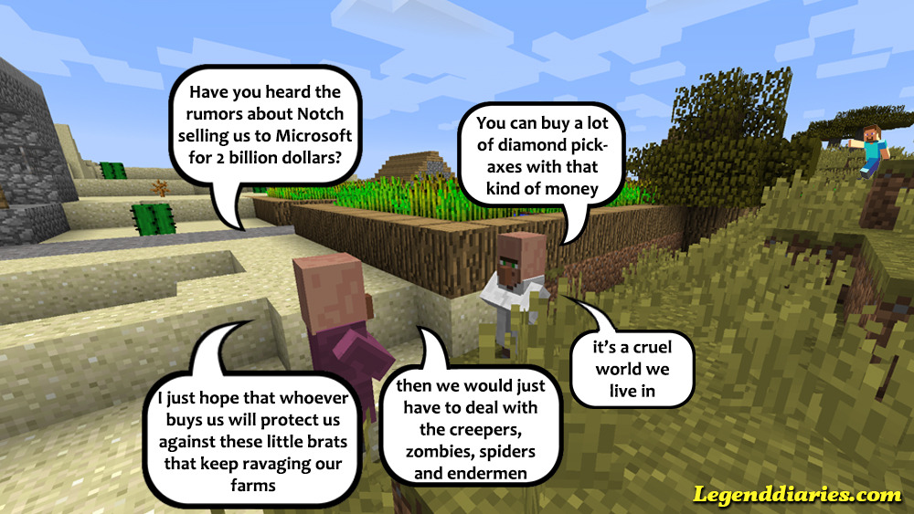

#### Did you want to buy Minecraft? Too late, Microsoft bought it for $2.5 billion. There were rumours all week about Microsoft buying Mojang, but now it has been confirmed. What does this mean for Minecraft and it's creator Notch?

Well Notch is now rich, that is for sure. It has been estimated that he has made over 1 billion dollars from the deal, which is basically infinite money. He does leave Mojang and thus Minecraft with this takeover. As do the two other key-developers. Marcus said he did not want the responsibility that comes with managing a company as large as Mojang.

Mojang is no longer a company with a couple of guys working on a game in a garage, but a company which sold millions of copies and is developing for almost every platform out there. This can kind of get in the way of 'just making games' if you are a major shareholder of said company. You can read more about Mojang's thoughts on this mega deal on [their blog](https://mojang.com/2014/09/yes-were-being-bought-by-microsoft/).

What Microsoft will do with the game is uncertain, but there will definitely be changes. It will probably become even more of a cash-cow , because Microsoft has to earn that 2.5 billion back somewhere. DLC and texture-packs might be added to the game against payments. Also Xbox exclusive content is a possibility. At least Phil Spencer is really enthusiastic about it.

http://youtu.be/lXNWchwDiG8

It might not be all bad. The fact is that a company like Microsoft has the resources and experience to make Minecraft more succesful and bigger than it already is. More content, merchandise and events might be the result of that, which benefits the players as well. As long as they are willing to take out their wallets of course.

I just hope they keep the core sandbox Minecraft experience and do not alter to much just to make it more profitable. I am also still waiting for the PS Vita version and will boycot anything from Microsoft until I get it! Even if it means I have to get a Mac...... Just joking, I will just install Linux then.
