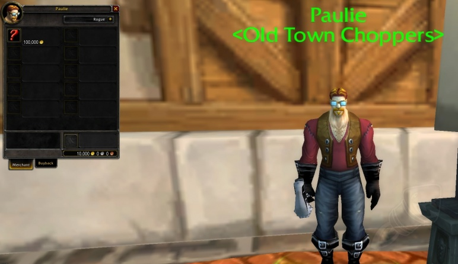

#### You might have seen it already, but the bike from the [Azeroth Chopper Series](http://eu.battle.net/wow/en/blog/14322660) is available  in WoD beta! Only For The Horde of course, since they won the contest (Darn it).

The Warlord's Deathwheel is not among the rides in your mount tab, but you can to summon it with '/cast Warlord's Deathwheel'. This will allow you to start roadtrippin' on the hordish chopper.  The model turned out great in my opinion and even the dreadful tank treads fit into the game. The sound that comes out of the exhausts makes you feel pretty though, so Horde players can definitely look forward to their free chopper or take it for a test spin in beta right now.

The Alliance bike [has been confirmed](http://www.wowhead.com/news=242384/wod-build-18689-alliance-chopper-cow-battle-pet-city-guard-transmog-challenge-mo) as well (surprise, surprise) but it is not available in beta as of yet. The Ally Chopper will not be free though, a vendor in Stormwind suggests that it cost a 100k gold.

